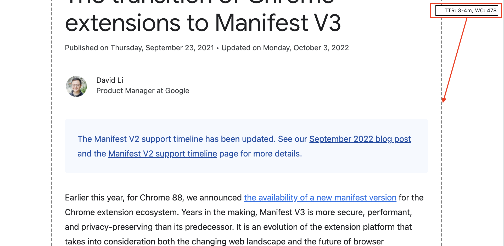

# Extension for reading speed calculations.

Super simple extension to calculate reading speed. POC.

Extension works calculating words on hover event for element.

It shows 2 values:
- TTR, time to read. min - max minutes, calculated for 120 and 200 words per minute rate.
- WC, just a word count.

## Why?

Because other extensions would only show overall number for whole page. This is not optimal for me.

## Todo:
- [x] Change border sizes to something more nice. 
- [] On/Off switch for extension, now it just do for all pages, all elements.
- [] Migrate to [Extension manifest v3](https://developer.chrome.com/blog/mv2-transition/).
- [] Publish to Chrome extension store.
- [] Code clean up.
- [] Add AI.

## Install (Dev)

Got to chrome extension page, allow local extensions and load this folder.

